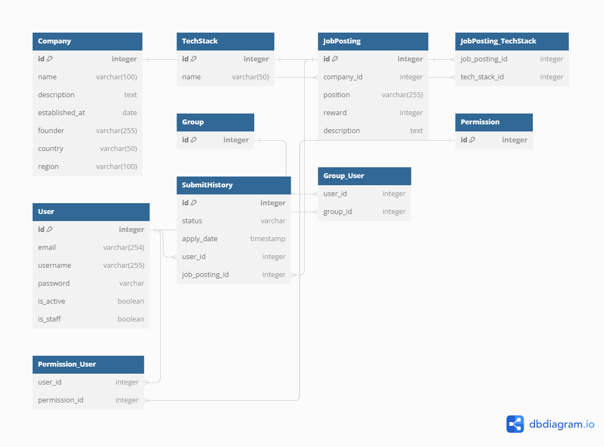

## Table of Contents
- [Table of Contents](#table-of-contents)
- [개요.](#개요)
- [사용 기술.](#사용-기술)
- [Limitation.](#limitation)
- [Git Convention:](#git-convention)
- [Known issue:](#known-issue)
  - [1. 점검 중, CompanyApp 에서 포착한 __init__ 마이그레이션 적용 문제.](#1-점검-중-companyapp-에서-포착한-init-마이그레이션-적용-문제)
  - [2. serializer 구조 문제로 인한, 생성된 채용 공고 조회 불가 문제.](#2-serializer-구조-문제로-인한-생성된-채용-공고-조회-불가-문제)
  - [3. DB 와 마이그레이션 - JobPosting 모델에 관련된 마이그레이션 이슈.](#3-db-와-마이그레이션---jobposting-모델에-관련된-마이그레이션-이슈)
  - [4. Serializers.py in JobPostingApp - tech\_stack 의 출력 이상.](#4-serializerspy-in-jobpostingapp---tech_stack-의-출력-이상)
- [ERD](#erd)
- [Entity-Relationship Diagram (ERD)](#entity-relationship-diagram-erd)
  - [Tables:](#tables)
    - [1. Company:](#1-company)
    - [2. TechStack:](#2-techstack)
    - [3. JobPosting:](#3-jobposting)
    - [4. JobPosting\_TechStack:](#4-jobposting_techstack)
    - [5. User:](#5-user)
    - [6. Group:](#6-group)
    - [7. Group\_User:](#7-group_user)
    - [8. Permission:](#8-permission)
    - [9. Permission\_User:](#9-permission_user)
    - [10. SubmitHistory:](#10-submithistory)

## 개요.

본 서비스는 기업의 채용을 위한 웹 서비스 입니다.

회사는 채용공고를 생성하고, 이에 사용자는 지원합니다.
## 사용 기술.
Django, PostgreSQL, DRF, flake8, black formatter

## Limitation.
Docker 컨테이너화 대신, 파이썬 가상환경 적용.

토큰 설정 생략.

## Git Convention:
feat – 변경 사항과 함께 새로운 기능이 도입된 경우

fix – 버그 수정 발생

chore – 수정 사항/기능과 관련이 없음. 또는 소스나 테스트를 수정하지 않은 변경 사항. (이 프로젝트의 경우, 종속성 업데이트 수정 관련 발생 시, 여기에 포함)

<!-- files - 변경 사항이 있지만, 파일 수정이 없는 경우. -->

refactor – 버그 수정 또는 기능을 추가하지 않는 리팩토링된 코드

docs – README 또는 앱 관련 문서.

<!-- style – 마크다운 및 UI 관련. -->

test – 새 테스트 스크립트 수정

<!-- perf – 성능 개선 -->

<!-- ci – CI/CD 같은 기능 관련. -->

<!-- build – 빌드 시스템 또는 외부 종속성에 영향을 미치는 변경 사항. -->

<!-- revert – reverts a previous commit -->
<!-- https://www.freecodecamp.org/news/how-to-write-better-git-commit-messages/ -->

## Known issue:

### 1. 점검 중, CompanyApp 에서 포착한 __init__ 마이그레이션 적용 문제.
특히 해당 부분의 DB migration을 초기화 한 후 재차 migrate 을 시도했지만, 유독 이 CompanyApp 에서만 migrate 가 적용되지 않았음. 해결 방법은 직접 psql 의 현 DB에 진입 후, 다음과 같이 쿼리문을 보내서 해당 문제되는 CompanyApp 모든 행 부분을 삭제.

`dbwanted=# DELETE FROM django_migrations WHERE app = 'CompanyApp';`

이로서 다시 migrate 적용이 가능 해 졌음.

원인은 최초에 해당 앱의 모델 변경 후, DB 초기화를 위해 삭제 했지만 알수 없는 이유로 마이그레이션 파일이 DB 쪽에서 예상대로 작동하지 않음. 이에, 직접 조치.

### 2. serializer 구조 문제로 인한, 생성된 채용 공고 조회 불가 문제.
문제 원인:

Serializer 구조: 

JobPostingSerializer 내에서 other_job_postings 필드는 현재 채용공고와 동일한 회사의 다른 채용공고를 나타내는데, 채용공고 생성 시에도 이 필드가 작동하게 됩니다.
DB 저장 시점: 새로운 채용공고를 생성할 때, 해당 채용공고는 아직 데이터베이스에 저장되지 않았습니다. 따라서 get_other_job_postings 메서드에서 해당 채용공고를 제외하려고 할 때, 아직 DB에 저장되지 않은 채용공고의 id를 알 수 없기 때문에 제외하지 못하게 됩니다.

해결 방법:

to_representation 오버라이딩: Serializer의 to_representation 메서드를 오버라이드하여, 채용공고가 아직 DB에 저장되지 않았을 경우 other_job_postings 필드를 반환하지 않게 조절하였습니다. 이를 통해 새로운 채용공고 생성 시 해당 필드가 빈 배열로 반환되는 문제를 해결하였습니다.

필드 조건 변경: 

채용공고 생성 요청에서는 other_job_postings 필드가 필요 없으므로, 이 필드를 생성 시점에서 제외하였습니다.
이렇게 변경을 통해 채용공고 생성 시 other_job_postings 필드가 적절하게 작동하도록 조정하였습니다.

### 3. DB 와 마이그레이션 - JobPosting 모델에 관련된 마이그레이션 이슈.
1. 이슈
- 데이터베이스(DB)의 `JobPosting` 모델에 관련된 마이그레이션 이슈 발생.
- `tech_stack` 필드 관련하여 DB와의 일관성 문제로 에러 발생.
- 특히 `JobPostingApp_techstack` 및 `JobPostingApp_jobposting_tech_stack` 테이블과 관련하여 문제 발생.
  
2. 원인
- 마이그레이션 파일과 실제 DB 상태 간의 불일치: 즉, 마이그레이션은 실행되었지만, 실제 DB에 반영되지 않았거나, 예상치 못한 방식으로 반영되어 에러가 발생.
- `tech_stack` 필드의 정의 및 처리 방식과 관련한 이슈: `JobPostingSerializer`에서 `tech_stack` 필드가 명시적으로 정의되지 않아서 생기는 문제. 

3. 해결방법
- **마이그레이션 및 DB 초기화**: 
  - `makemigrations` 및 `migrate` 명령어를 사용하여 마이그레이션을 다시 생성하고 적용.
  - 필요한 경우, DB를 초기화하고 마이그레이션을 다시 적용.
- **모델 및 시리얼라이저 수정**:
  - `JobPostingSerializer`에 `tech_stack` 필드를 명시적으로 추가.
  - `tech_stack` 필드에 대한 적절한 검증 및 저장 로직을 구현.
  - `to_representation` 메서드를 사용하여 응답 형식을 조정.
  
이러한 해결 방법을 통해, 입력된 `tech_stack` 데이터를 정상적으로 처리하고, 응답 데이터에도 원하는 형태로 `tech_stack`을 포함시킬 수 있었습니다.

### 4. Serializers.py in JobPostingApp - tech_stack 의 출력 이상.
1. 이슈
- `JobPosting`을 생성하거나 수정할 때, `tech_stack` 필드에 대한 데이터가 올바르게 처리되지 않음.
- API 응답에서 `tech_stack` 필드가 비어 있거나, 원하는 형태로 출력되지 않음.

2. 원인
- `JobPostingSerializer`에서 `tech_stack` 필드가 초기값(initialisation)을 갖지 않았음.
- 따라서, 입력 데이터를 올바르게 처리하고, 해당 필드를 DB에 저장하는 로직이 누락되었음.

3. 해결방법
- `JobPostingSerializer`에 `tech_stack` 필드를 명시적으로 정의.
- 해당 필드에 대한 검증 및 저장 로직(`validate_tech_stack` 및 `create` 메서드)을 추가.
- `to_representation` 메서드를 사용하여 응답 데이터의 형태를 조정하여, `tech_stack`을 원하는 형태로 출력하도록 수정.

이를 통해 `tech_stack` 데이터가 올바르게 처리되었으며, API 응답에서도 원하는 형태로 `tech_stack` 정보가 출력되게 되었습니다.

## ERD

## Entity-Relationship Diagram (ERD)

이 프로젝트의 데이터베이스 구조는 다음과 같은 엔터티와 관계를 가지고 있습니다. 아래의 ERD 이미지와 함께 각 테이블과 필드, 그리고 테이블 간의 참조 관계를 확인하실 수 있습니다.

### Tables:

#### 1. Company:
- **Fields**: `id`, `name`, `description`, `established_at`, `founder`, `country`, `region`
- **Description**: 회사의 기본 정보를 저장하는 테이블입니다.

#### 2. TechStack:
- **Fields**: `id`, `name`
- **Description**: 사용하는 기술 스택 정보를 저장하는 테이블입니다.

#### 3. JobPosting:
- **Fields**: `id`, `company_id`, `position`, `reward`, `description`
- **Relationships**: `Company` (ForeignKey), `TechStack` (ManyToMany)
- **Description**: 채용공고 정보를 저장하며, 회사와 기술 스택 정보와 연결됩니다.

#### 4. JobPosting_TechStack:
- **Fields**: `job_posting_id`, `tech_stack_id`
- **Description**: 채용공고와 기술 스택 간의 다대다 관계를 관리하는 연결 테이블입니다.

#### 5. User:
- **Fields**: `id`, `email`, `username`, `password`, `is_active`, `is_staff`
- **Description**: 사용자 정보를 저장하는 테이블입니다.

#### 6. Group:
- **Fields**: `id`
- **Description**: 사용자 그룹 정보를 저장하는 테이블입니다.

#### 7. Group_User:
- **Fields**: `user_id`, `group_id`
- **Description**: 사용자와 그룹 간의 관계를 관리하는 연결 테이블입니다.

#### 8. Permission:
- **Fields**: `id`
- **Description**: 사용자 권한 정보를 저장하는 테이블입니다.

#### 9. Permission_User:
- **Fields**: `user_id`, `permission_id`
- **Description**: 사용자와 권한 간의 관계를 관리하는 연결 테이블입니다.

#### 10. SubmitHistory:
- **Fields**: `id`, `status`, `apply_date`, `user_id`, `job_posting_id`
- **Relationships**: `User` (ForeignKey), `JobPosting` (ForeignKey)
- **Description**: 사용자의 지원 이력을 저장하며, 사용자와 채용공고 정보와 연결됩니다.

